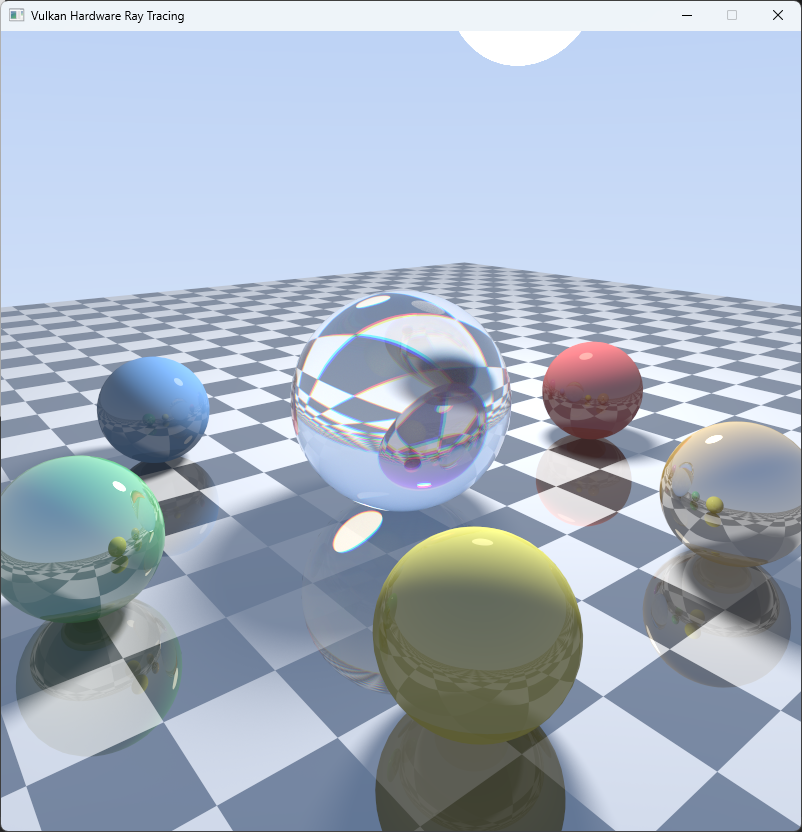

# Vulkan Hardware Ray Tracing

A real-time, hardware-accelerated ray tracer built on the Vulkan ray tracing
pipeline (`VK_KHR_ray_tracing_pipeline`). It runs on the GPU's dedicated RT cores
using acceleration structures, a ray-gen / closest-hit / miss shader pipeline and
a shader binding table. This is genuine hardware ray tracing, not a compute-shader
software tracer.

Zero external dependencies beyond the Vulkan SDK itself: the window is created
with raw Win32 (no GLFW) and all math is inline (no GLM).



## Features

- **Hardware ray tracing** — BLAS + TLAS, a full RT pipeline (ray generation,
  closest-hit and two miss shaders) and a correctly aligned shader binding table.
- **Reflections** — traced iteratively from the ray-gen shader, so
  `maxPipelineRayRecursionDepth = 1`, which every RT-capable GPU supports.
- **Temporal accumulation + anti-aliasing** — each frame casts several jittered
  samples per pixel (4 by default) and blends the result into an
  `R32G32B32A32_SFLOAT` accumulation buffer. The multi-sampling keeps motion
  smooth, and while the camera is still the image progressively refines to a
  clean, noise-free result; it resets the moment the camera moves.
- **Soft shadows from an area light** — the scene is lit by a spherical area
  light (a visible emissive sphere). Each shading point samples the cone the light
  subtends, so the penumbra widens with the occluder's distance, like real soft
  shadows, and sharpens as the accumulation converges.
- **Glass with chromatic dispersion** — the central sphere is dielectric glass
  with Fresnel-weighted reflection and refraction (Schlick) and total internal
  reflection. Refraction uses a different IOR per colour channel via spectral
  (hero-wavelength) sampling, so the glass splits light into faint rainbow edges.

The scene is a reflective checkerboard floor, a central glass sphere and a ring of
six coloured spheres (some matte, some reflective), lit by a spherical area light
that is itself visible in the scene and in reflections.

## Controls

| Input            | Action                          |
|------------------|---------------------------------|
| Left mouse drag  | Orbit the camera                |
| Mouse wheel      | Zoom in / out                   |
| Esc              | Quit                            |

Hold still for a moment and watch the image converge — that is the accumulation
buffer averaging samples and cleaning up the soft-shadow and glass noise.

## Requirements

- Windows 10/11, x64.
- Visual Studio 2022 (toolset v143). The free Community edition is fine.
- [Vulkan SDK](https://vulkan.lunarg.com/) installed (sets the `VULKAN_SDK`
  environment variable, which the project uses for include/lib paths and the
  shader compiler).
- A ray-tracing capable GPU with current drivers:
  NVIDIA RTX 20-series or newer, AMD RX 6000-series or newer, or Intel Arc.

## Build & run

1. Open `VulkanRayTracing.sln` in Visual Studio 2022.
2. Select the `x64` platform (`Debug` or `Release`).
3. Build and run (F5).

The shaders are compiled to SPIR-V automatically by a pre-build step
(`compile_shaders.bat`) and copied next to the executable. You can also run that
batch file by hand at any time.

A console window shows the selected GPU and, in Debug builds, Vulkan validation
output.

## Project layout

```
VulkanRayTracing.sln
VulkanRayTracing.vcxproj
compile_shaders.bat          shader -> SPIR-V build step
src/main.cpp                 all host code (window, Vulkan, RT setup, render loop)
shaders/raygen.rgen          camera rays, accumulation, AA, reflections,
                             soft shadows, glass, gamma
shaders/closesthit.rchit     vertex fetch + barycentric interpolation -> surface payload
shaders/miss.rmiss           primary miss (escaped ray -> sky)
shaders/shadow.rmiss         shadow miss (point is lit)
```

## Notes

- The window is a fixed 1280x720 and non-resizable, which keeps the swapchain
  logic minimal and the code easy to read.
- Vulkan clip space has Y pointing down, handled by a negative `m[5]` in
  `perspectiveVk`. If the image ever shows up vertically flipped on your driver,
  flip the sign of that one term and rebuild.
- The displayed image is an `R8G8B8A8_UNORM` storage image (matching the `rgba8`
  shader qualifier) copied to the swapchain with `vkCmdBlitImage`, which maps
  colour components by name, so colours stay correct whether the swapchain is
  RGBA or BGRA.
- Quality / look knobs: `shaders/raygen.rgen` holds the bounce count, the
  per-channel `IOR_R/G/B` (widen the spread for stronger dispersion), and the
  emissive light brightness. `updateUniforms` on the host sets the light position,
  the light radius (`lightPos[3]` — bigger = softer shadows), the intensity, and
  `params[3]`, the number of samples cast per frame (raise it for smoother motion,
  lower it for more speed on weaker GPUs).
